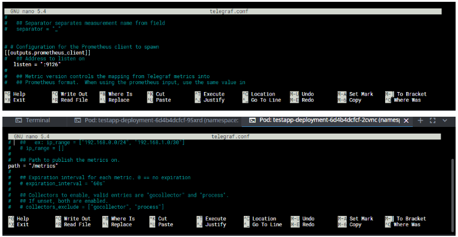
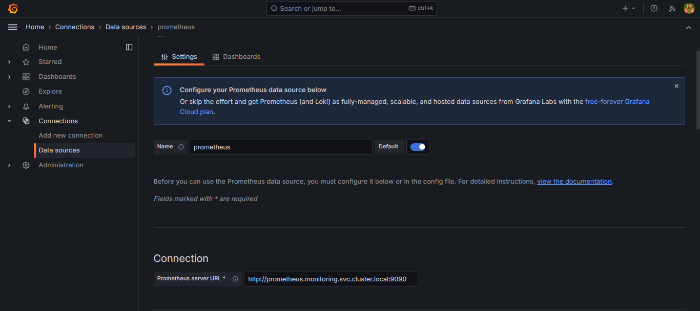
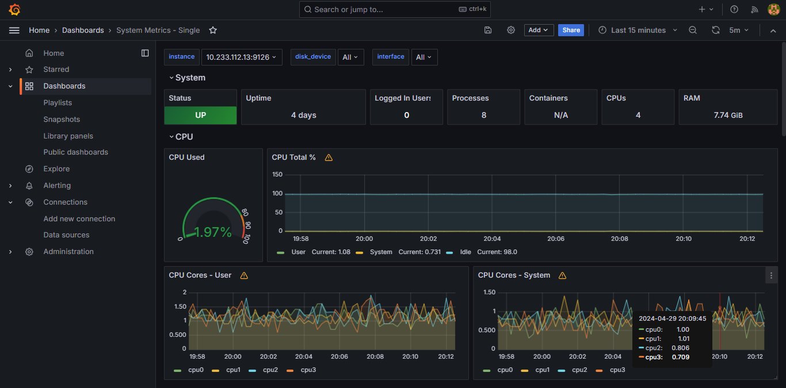

# Cài prometheus, grafana và telegraf để monitor pod với đồ thị trực quan - Hướng dẫn

## Exec vào các pod, cài telegraf để đưa metrics ra cổng chỉ định

Cài các package cần thiết
```
apt update
apt install nano wget -y
```

Cài telegraf
```
wget https://dl.influxdata.com/telegraf/releases/telegraf_1.20.2-1_amd64.deb
dpkg -i telegraf_1.20.2-1_amd64.deb
```

Cấu hình cổng
```
cd etc/telegraf
nano telegraf.conf
```

Sửa file conf như sau


Chạy service
```
service telegraf restart
```

## Cài đặt prometheus, grafana và config map (đảm bảo đã tạo namespace monitoring)
```
kubectl apply -f grafana.yaml
kubectl apply -f prometheus-config.yaml
kubectl apply -f prometheus.yaml
```

## Kết nối prometheus và grafana để xem đồ thị
Forward cổng của Grafana ra localhost và tạo kết nối tới Prometheus
```
Username: admin
Password: admin
```

Sau đó tạo dashboard từ kết nối với id 6149

## Kết quả
