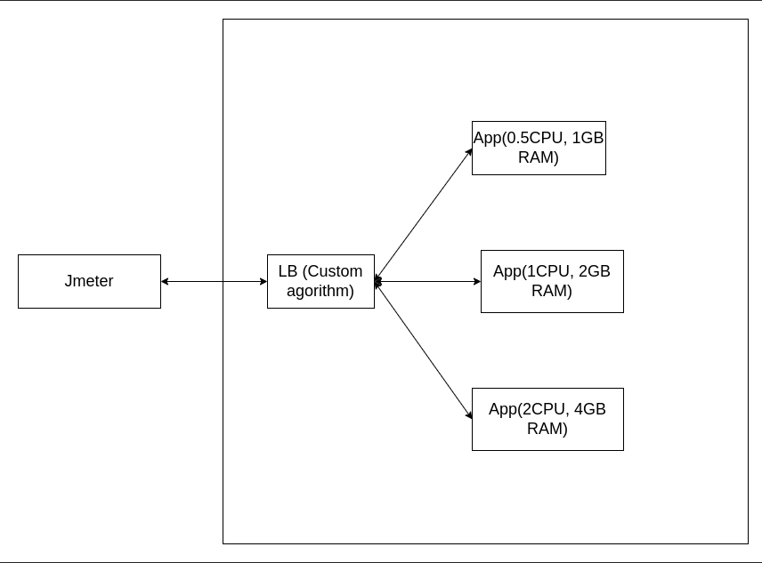

# Load balancer project



# Dựng pod backend đơn giản
## Viết app đơn giản
Viết ứng dụng đơn giản bằng java thông ra một api để có thể get được bằng postman

Ứng dụng được viết tương tự như video sau: 

`How to Create Spring Boot Project in IntelliJ | Community FREE Edition`

Ứng dụng này sẽ chạy ở cổng 8080 và khi gửi request đến API :

`/welcome`: “Hello world!”

`/downloaded`: File text 1Mb

Tiếp theo ta build image với tên là: henrypham2801/datptdownload

và đóng lên docker hub để có thể tạo được pod

## Dựng pod từ app
Pod được dựng từ file deployment sau:

```
apiVersion: apps/v1
kind: Deployment
metadata:
  name: testapp-deployment
spec:
  replicas: 3
  selector:
    matchLabels:
      app: testapp-deployment
  template:
    metadata:
      labels:
        app: testapp-deployment
    spec:
      containers:
      - name: testapp-deployment
        image: henrypham2801/datptdownload
        ports:
        - containerPort: 8080
```

Sau đó chạy lệnh: 

`kubectl apply -f <tên_file>  -n <tên_namespace>`

Vậy là hoàn thành việc tạo 3 app. Giờ ta có thể forward port ra ngoài để xem app có chạy ngon không và test lại

# Dựng pod backend phiên bản nâng cấp (Author: Thành)

(Trình bày các API và manifest để dựng pod vào đây)

# Dựng pod NGINX.

Sau khi có 3 pod backend, ta tiến hành dựng pod NGINX bằng deployment sau:
```
apiVersion: apps/v1
kind: Deployment
metadata:
  name: nginx-deployment
spec:
  replicas: 1
  selector:
    matchLabels:
      app: nginx-deployment
  template:
    metadata:
      labels:
        app: nginx-deployment
    spec:
      containers:
      - name: nginx-deployment
        image: nginx
        ports:
        - containerPort: 80
        - containerPort: 8081
        volumeMounts:
        - name: nginx-config
          mountPath: /etc/nginx/conf.d
      volumes:
      - name: nginx-config
        configMap:
          name: nginx-config
---
apiVersion: v1
kind: ConfigMap
metadata:
  name: nginx-config
data:
  datpt.conf: |
    upstream backend {
      server 10.233.102.205:8080;
      server 10.233.102.210:8080;
      server 10.233.102.212:8080;
    }
    server {
      listen 8081;
      server_name localhost;
      location / {
        proxy_pass http://backend/download;
      }
    }
```
`Lưu ý`: Thay config vào trong config map cho phù hợp, sau đó apply là được